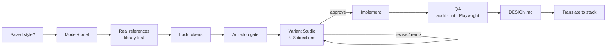

<p align="center">
  <picture>
    <source media="(prefers-color-scheme: dark)" srcset="assets/brand/lockup-dark.png">
    
  </picture>
</p>

<h1 align="center">DesignerSkill</h1>

<p align="center">
  <b>An agent skill that designs UI from real references, not from defaults.</b><br>
  Websites · phone apps · game UI — tokens first, variants you pick in the browser, QA'd, documented, translated to your stack.
</p>

<p align="center">
  
  
  
  
  
</p>

<p align="center">
  <a href="#quick-start">Quick start</a> ·
  <a href="#usage">Usage</a> ·
  <a href="#how-it-works">How it works</a> ·
  <a href="#saved-styles">Saved styles</a> ·
  <a href="#translate-to-your-stack">Translate</a> ·
  <a href="designer/INSTALL.md">Install guide</a>
</p>

---

AI-generated UI tends to converge on the same thing: Inter, `rounded-xl`, an indigo gradient, a hero with three cards. **designer** is a skill for coding agents that refuses that default. It makes the agent reverse-engineer real products first, lock a token set before writing markup, show you 3–8 genuinely different directions in a live gallery, and only then build — with an automated anti-slop gate, visual QA, a written design spec and a translation step to the stack you actually ship.

## Quick start

Requirements: [Node.js 18+](https://nodejs.org) and git. Works on **Windows**, **macOS** and Linux.

**macOS / Linux** (Terminal):

```bash
git clone --recurse-submodules https://github.com/Kekko16004/DesignerSkill.git
cd DesignerSkill
./install.sh
```

No Node yet on macOS? `brew install node` (or the installer from nodejs.org). You can also double-click `install.command` in Finder.

**Windows** (PowerShell 5.1+):

```bat
git clone --recurse-submodules https://github.com/Kekko16004/DesignerSkill.git
cd DesignerSkill
install.bat
```

The installer asks where to install (Claude Code, Kilo Code, Codex, Antigravity, Cursor, OpenCode, Copilot, Windsurf), which external components to fetch from GitHub, and which reference sites the agent may open. Restart your agent afterwards.

Keep everything current with one click: `./update.sh` (or `update.command`) on macOS / Linux, `update.bat` on Windows. It pulls this repo, updates Variant Studio and transitions.dev, and reinstalls with your previous choices. Full details: [designer/INSTALL.md](designer/INSTALL.md).

## Features

| | |
|---|---|
| **Real references** | Reverse-engineers comparable apps, sites and games (Game UI Database, Interface In Game, App Store…) and keeps a reusable reference library. |
| **Tokens before code** | Every decision is a CSS custom property, locked before any HTML/JSX. |
| **Variant Studio** | 3–8 directions in a live browser gallery: compare, comment on elements, tune tokens, approve / revise / combine. |
| **Anti-slop gate** | `lint-slop` flags generic fonts, indigo gradients, `rounded-xl` everywhere, emoji icons, SaaS copy, raw hex outside the tokens. |
| **Visual QA** | Studio accessibility audit + Playwright screenshots, hover/click states, honest viewports. |
| **Saved styles** | `/createstyle` captures a project's look (or one you describe) once; `/designer <style> …` reuses it everywhere. |
| **DESIGN.md** | Every run leaves a written spec another agent can rebuild from. |
| **Translate** | Approved preview → plain HTML, React, React Native, Unity UI Toolkit (UXML/USS), and tokens for Tailwind, Flutter, SwiftUI. |
| **Game-aware** | HUD, inventory, shop, menus; FiveM/RedM NUI rules only when you ask for them. |

## Usage

```text
/designer login page for a banking app
/designer onboarding flow for a habit tracker, iOS feel, React Native
/designer inventory screen for a souls-like, desktop, Unity UI Toolkit
/designer kfdev settings screen                  ← first word = saved style
/designer pricing page using the kfdev style     ← style mentioned anywhere works too
```

```text
/createstyle                                     ← extract the current project's style
/createstyle kfdev                               ← same, with an explicit name
/createstyle noir dark editorial, cream paper, red accent, Fraunces headlines, square corners
```

You can also just ask in plain language — *"use the designer skill to redo this header"*.

## How it works



| Mode | Used for | Sources |
|---|---|---|
| `product-app` | phone apps, web apps, dashboards, agent UIs | comparable real apps, Beautiful UI, 21st (restyled parts) |
| `marketing` | websites, landings, pricing | 1–2 real sites of the same tone, one direction |
| `game` | HUD, inventory, shop, menus, NUI | Game UI Database, Interface In Game, the reference library |

The default is website or phone app; game UI only when the request is about a game.

## Saved styles

A style is a reusable identity — tokens, explained rules, reference screenshots — stored once in `~/.designer/styles/` and visible to every agent the skill is installed in.

```text
~/.designer/styles/kfdev/
  STYLE.md      the style, explained (identity, type, shape, components, do/don't)
  tokens.css    locked custom properties
  tokens.json   generated, for other stacks
  meta.json     name, aliases, mode, source
  screenshots/
```

`/createstyle` either **extracts** the style from the current project (CSS variables, Tailwind config, fonts, color frequencies, screenshots) or **builds it from your description** without reading anything.

## Translate to your stack

```bash
node designer/scripts/translate.mjs <target> <approved-variant.html> --out <dir> --name <Name>
```

| Target | Output |
|---|---|
| `html` | standalone page, CSS inlined |
| `react` | `Name.jsx` + `Name.css` |
| `rn` | React Native component + `StyleSheet` |
| `uitk` | Unity UI Toolkit `UXML` + `USS` (+ extracted SVG icons) |
| `tokens` | `json`, Tailwind theme, `USS`, TypeScript, Flutter `Color`, SwiftUI `Color` |

Every run writes a `.report.md` listing what could not be carried over (box-shadow in USS, gradients in React Native…) so nothing is lost silently. For complex UIs the skill rewrites by hand instead.

## Scripts

All scripts are plain Node (≥ 18) with zero dependencies.

| Script | Purpose |
|---|---|
| `scripts/studio.mjs` | Proxy to the standalone [Variant Studio](https://github.com/Fonlogen/variant-studio) (`where`, `start`, `new`, `wait`, …) |
| `scripts/styles.mjs` | Global styles and reference library: `list`, `show`, `match`, `init`, `lib` |
| `scripts/extract-style.mjs` | Mechanical style scan of a project |
| `scripts/lint-slop.mjs` | Automated anti-slop gate: `PASS` / `PATCH` / `REDO_TOKENS` |
| `scripts/translate.mjs` | Preview → `html` · `react` · `rn` · `uitk` · `tokens` |

## External components

Referenced in [dependencies.json](dependencies.json), never copied into the skill. The installer asks before fetching each one.

| Component | Source | Installed as |
|---|---|---|
| Variant Studio | [Fonlogen/variant-studio](https://github.com/Fonlogen/variant-studio) | git submodule, linked into every host |
| transitions.dev | [Jakubantalik/transitions.dev](https://github.com/Jakubantalik/transitions.dev) | skill via `npx skills add` |
| 21st.dev MCP | [21st.dev](https://21st.dev) | MCP server, key in `API_KEY_21ST` (optional) |

Without API keys the skill still works: Playwright + web search + Variant Studio.

## Repository layout

```text
designer/                 the skill
  SKILL.md                entry point read by the agent
  references/             pipeline details: modes, tokens, anti-slop, styles, translate, fivem-nui…
  assets/                 mock shell, token template, DESIGN.md / STYLE.md templates
  command/                /designer, /createstyle
  scripts/                studio proxy, styles, extract-style, lint-slop, translate
  evals/                  test prompts to re-run after changing the skill
  install.ps1 · update.ps1   Windows installer / updater
  install.sh · update.sh     macOS / Linux installer / updater
variant-studio/           git submodule (Fonlogen/variant-studio)
assets/brand/             logo: SVG sources, PNG exports, brand spec
install.bat · update.bat  one-click shortcuts (Windows)
install.sh · update.sh    shortcuts (macOS / Linux); install.command · update.command for Finder
dependencies.json         external components
```

## Contributing

Changes to the skill should keep [designer/evals/prompts.md](designer/evals/prompts.md) passing and `lint-slop` clean. The skill text is English; scripts stay dependency-free.

## Credits

[Variant Studio](https://github.com/Fonlogen/variant-studio) by Fonlogen · [transitions.dev](https://github.com/Jakubantalik/transitions.dev) and [thinking-orbs](https://github.com/Jakubantalik/thinking-orbs) by Jakub Antalik · [21st.dev](https://21st.dev) · [Beautiful UI](https://www.beautifului.dev) · [Game UI Database](https://www.gameuidatabase.com) · [Interface In Game](https://interfaceingame.com) · [game-icons.net](https://game-icons.net).
